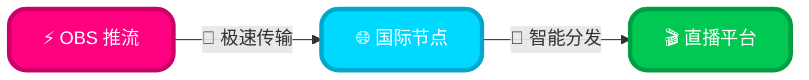
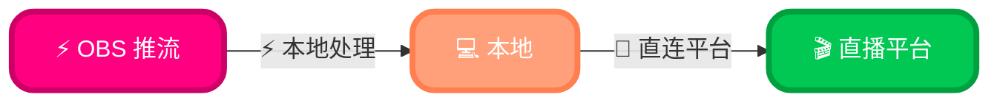
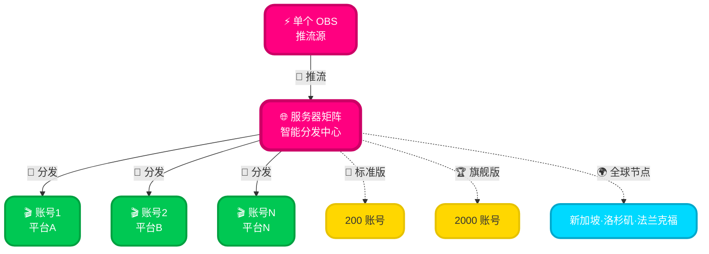

# 🌊 Kaze Stream Manager

### 企业级智能流媒体分发平台 | AI 驱动 · 全球部署 · 极致性能

---

 

## 📦 快速下载

<table>
<tr>
<td width="50%" align="center">

### 🚀 Kaze Relay 主程序

  

</td>
<td width="50%" align="center">

### 🛠️ 配套 OBS 工具包

  

</td>
</tr>
</table>

### 📖 详细教程

 

## 📈 平台核心数据

<table>
<tr>
<td align="center" width="25%">

  
<h2>10 TB</h2>
全球每日数据吞吐量
</td>
<td align="center" width="25%">

  
<h2>1000</h2>
同时在线账号数
</td>
<td align="center" width="25%">

  
<h2>< 15ms</h2>
平均接口响应延迟
</td>
<td align="center" width="25%">

  
<h2>3000+</h2>
覆盖 50+ 国家和地区
</td>
</tr>
</table>

 

## ✨ 核心特性

<table>
<tr>
<td width="50%" align="center">

### 🎯 智能推流引擎

 
混合云架构 | 云端国际服务器 / 本地直推 | 实时自适应切换

 
零配置部署 | RPA 自动化流程 | 智能参数优化

 
AI 预测式断线修复 | 亚秒级故障切换 | 零感知恢复

</td>
<td width="50%" align="center">

### 🔒 企业级安全

 
沙箱级隔离技术 | 独立会话容器 | 零数据交叉污染

 
SOCKS5/HTTP/HTTPS 全协议 | 动态 IP 池 

 
BGP Anycast 智能路由 | 三大洲节点 | 毫秒级就近接入

</td>
</tr>
<tr>
<td width="50%" align="center">

### 🚀 极致性能

 
QUIC 协议加速 | UDP 优化传输 | 端到端延迟 < 500ms

 
7×24 云端守护 | 心跳检测 100ms | 故障切换 < 1s

 
极简内核设计 | 单账号 < 100MB | 支持 10K+ 并发

</td>
<td width="50%" align="center">

### 💼 企业级运维

 
分布式集群架构 | 单节点 200 账号 | 弹性扩容至 2000+

 
硬件绑定 | 多级权限管理

 
实时监控大屏 | 全链路追踪 | ELK 日志分析系统

</td>
</tr>
</table>

 

## 🎬 快速开始

<table>
<tr>
<td width="33%" align="center">

### 1️⃣ 添加账号

  

点击 **"添加账号"**

↓

浏览器自动打开

↓

完成登录

↓

自动导入

</td>
<td width="33%" align="center">

### 2️⃣ 获取推流权限

  

选择账号

↓

点击 **"获取推流码"**

↓

选择推流模式

↓

完成

</td>
<td width="33%" align="center">

### 3️⃣ 开始推流

  

**方式一（推荐）**

点击 **"一键推流"**

OBS 自动配置并开始推流

 

**方式二**

手动复制推流地址到 OBS

手动启动

</td>
</tr>
</table>

 

<table>
<tr>
<td align="center">

### 🌐 企业版服务器矩阵快速部署 

 

<table width="100%">
<tr>
<td width="25%" align="center">

**1️⃣ 联系咨询**

📧 enterprise@kazerelay.com

提供需求和规模

</td>
<td width="25%" align="center">

**2️⃣ 定制方案**

🤝 24小时响应

专属方案报价

</td>
<td width="25%" align="center">

**3️⃣ 部署上线**

⚡ 快速开通

服务器配置完成

</td>
<td width="25%" align="center">

**4️⃣ 批量推流**

🚀 导入账号

一键批量推流

</td>
</tr>
</table>

 

</td>
</tr>
</table>

 

## 🏗️ 核心技术架构

<table>
<tr>
<td width="33%" align="center">

### ⚡ 自研流媒体引擎

**核心技术**
- 🔬 自研高性能编解码引擎
- ⚡ 硬件加速渲染技术
- 🧬 自适应码流控制算法
- 🎯 低延迟帧同步机制

</td>
<td width="33%" align="center">

### 🧠 AI 智能调度系统

**核心能力**
- 🎯 网络质量预测模型
- 🌊 智能流量调度算法
- 📊 自适应负载均衡
- 🛡️ 异常检测与自愈

</td>
<td width="33%" align="center">

### 🌐 云原生架构

**基础设施**
- 🕸️ 分布式服务网格
- 📡 全链路监控追踪
- ⚡ 熔断降级机制
- 🎯 灰度发布系统

</td>
</tr>
</table>

 

<table>
<tr>
<td align="center">

### 🔐 企业级安全防护体系

  

<table width="100%">
<tr>
<td width="33%" valign="top">

**🔒 传输层安全**
- 🔐 端到端加密传输
- 🛡️ 零信任安全架构
- ⚡ 完美前向保密 (PFS)
- 🔑 动态密钥管理

</td>
<td width="33%" valign="top">

**🛡️ 应用层防护**
- 🌊 智能流量清洗系统
- ⚔️ Web 应用防火墙
- 🎯 AI 威胁检测引擎
- 🚀 自适应访问控制

</td>
<td width="34%" valign="top">

</td>
</tr>
</table>

</td>
</tr>
</table>

 

## 🌟 高级功能

<table>
<tr>
<td width="50%">

### ☁️ 云端国际服务器模式

**优势**：
- ✅ 全球节点部署，高稳定性
- ✅ 支持代理推流，IP 隔离
- ✅ 智能托管，无人值守

</td>
<td width="50%">

### 🖥️ 本地直推模式

**优势**：
- ✅ 延迟更低
- ✅ 完全可控
- ✅ 本地处理

</td>
</tr>
<tr>
<td colspan="2" align="center">

### 🌐 服务器矩阵推流 

**核心优势**：
- ⚡ **大规模并发**：单服务器矩阵支持最多 200 个账号同时推流
- 🎯 **企业定制**：可定制支持高达 2000 个账号的超大规模矩阵方案
- 🌍 **全球节点**：🇸🇬 新加坡 | 🇺🇸 洛杉矶 | 🇩🇪 法兰克福，就近接入降低延迟
- 🔄 **智能分配**：自动负载均衡，优化资源利用率
- 📊 **统一管理**：一个 OBS 控制多个账号，批量操作、实时监控
- 🛡️ **账号隔离**：每个账号独立会话，互不影响，完全隔离

</td>
</tr>
</table>

 

## 🔧 系统要求

<table>
<tr>
<td align="center" width="25%">

**操作系统**

Windows 10 及以上

</td>
<td align="center" width="25%">

**内存**

建议 4GB+

</td>
<td align="center" width="25%">

**网络**

稳定的宽带连接

</td>
<td align="center" width="25%">

**OBS**

28.0 及以上

</td>
</tr>
</table>

 

<table>
<tr>
<td align="center">

### 🌐 服务器矩阵企业版配置要求

  

**⚙️ 核心架构**：弹性计算资源 | 根据业务规模智能定制 | 企业级高可用架构

**💎 性能等级**：
- **标准版**（200-500 账号）：高性能计算集群 | 千兆网络吞吐 | 智能负载均衡
- **旗舰版**（500-2000 账号）：超大规模矩阵 | 万兆骨干网络 | 分布式容灾备份

**🚀 部署方案**：
- **云端托管**（推荐）：多云混合架构 | 全球 CDN 加速 | 7×24 智能运维 | 自动故障转移
- **私有化部署**：完全数据主权 | 定制安全策略 | 内网隔离 | 等保合规支持

**🔒 企业级特性**：99.99% SLA 保障 | DDoS/WAF 安全防护 | 实时性能监控 | 弹性横向扩展

 

**🌍 全球节点部署**：

**智能路由**：自动选择最近节点 | **延迟优化**：< 50ms 区域内延迟 | **容灾备份**：多节点热备

</td>
</tr>
</table>

 

## 📊 推流模式对比

<table>
<thead>
<tr>
<th width="15%">特性</th>
<th width="28%" align="center">☁️ 云端国际服务器</th>
<th width="28%" align="center">🖥️ 本地直推</th>
<th width="29%" align="center">🌐 服务器矩阵 </th>
</tr>
</thead>
<tbody>
<tr>
<td><b>稳定性</b></td>
<td align="center">

</td>
<td align="center">

</td>
<td align="center">

</td>
</tr>
<tr>
<td><b>延迟</b></td>
<td align="center">

</td>
<td align="center">

</td>
<td align="center">

</td>
</tr>
<tr>
<td><b>断线恢复</b></td>
<td align="center">

</td>
<td align="center">

</td>
<td align="center">

</td>
</tr>
<tr>
<td><b>代理支持</b></td>
<td align="center">

</td>
<td align="center">

</td>
<td align="center">

</td>
</tr>
<tr>
<td><b>托管功能</b></td>
<td align="center">

</td>
<td align="center">

</td>
<td align="center">

</td>
</tr>
<tr>
<td><b>账号规模</b></td>
<td align="center">

</td>
<td align="center">

</td>
<td align="center">

</td>
</tr>
<tr>
<td><b>批量管理</b></td>
<td align="center">

</td>
<td align="center">

</td>
<td align="center">

</td>
</tr>
<tr>
<td><b>负载均衡</b></td>
<td align="center">

</td>
<td align="center">

</td>
<td align="center">

</td>
</tr>
<tr>
<td><b>适用场景</b></td>
<td align="center">

</td>
<td align="center">

</td>
<td align="center">

</td>
</tr>
<tr>
<td><b>全球节点</b></td>
<td align="center">

</td>
<td align="center">

</td>
<td align="center">

</td>
</tr>
<tr>
<td><b>价格定位</b></td>
<td align="center">

</td>
<td align="center">

</td>
<td align="center">

</td>
</tr>
</tbody>
</table>

 

## 💡 使用建议

<table>
<tr>
<td width="50%">

### ☁️ 适合云端国际服务器的场景

 

- 🕐 **需要长时间稳定推流**
- 📡 **网络环境不稳定**
- 🔐 **需要使用代理服务**
- 📊 **多账号批量管理**

</td>
<td width="50%">

### 🖥️ 适合本地直推的场景

 

- ⚡ **对延迟要求极高**
- 🌐 **网络环境优秀**
- ⏱️ **短时间推流**

</td>
</tr>
<tr>
<td colspan="2" align="center">

### 🌐 适合服务器矩阵的场景 

 

<table width="100%">
<tr>
<td width="50%" valign="top">

#### 🏢 企业级应用
- 💼 **MCN 机构**：管理大量主播账号
- 🎯 **电商直播**：多店铺同时直播
- 📺 **传媒公司**：多平台内容分发
- 🎬 **活动直播**：大型活动多机位推流

</td>
<td width="50%" valign="top">

#### 🚀 技术优势场景
- 📊 **批量运营**：支持 200-2000 个账号
- 🔄 **自动化管理**：统一调度和监控
- 🛡️ **高可用性**：云端容灾，99.9% 在线率
- 📈 **弹性扩容**：根据业务需求灵活定制

</td>
</tr>
</table>

</td>
</tr>
</table>

 

## ⚙️ 配置说明

<table>
<tr>
<td width="50%">

### 🎥 OBS 设置（一键推流时自动配置）

 

- **视频编码器**：x264 或 NVENC（推荐）
- **码率**：2500-4000 kbps
- **关键帧间隔**：2 秒
- **CPU 使用预设**：veryfast 或 faster

</td>
<td width="50%">

### 🌐 网络优化

 

- **连接方式**：建议使用有线网络
- **上传带宽**：建议 > 5 Mbps
- **代理设置**：如使用代理，确保代理稳定性

</td>
</tr>
</table>

 

## 📝 更新日志

<b>🔥 v1.5.0 (2025-10-07)</b>

 

- 🌐 **重磅功能**：新增服务器矩阵推流支持
  - ⚡ 单服务器最大支持 200 个账号同时推流
  - 🎯 企业定制版可支持高达 2000 个账号
  - 📊 提供统一的批量管理和实时监控
  - 🔄 智能负载均衡，自动优化资源分配
- ✨ 优化企业级账号管理功能
- 🐛 修复云端中继创建失败时的误判问题
- 🐛 修复模式切换时标记未正确清除的问题
- ✨ 优化错误提示信息，更准确的问题定位
- ⚡ 改进账号状态同步机制

<b>📦 v1.4.0 (2025-09)</b>

 

- ✨ 新增云端托管功能，支持断线自动重连
- ✨ 支持多区域服务器节点选择
- 🐛 修复多账号并发推流时的状态冲突

<b>🎯 v1.3.0 (2025-07)</b>

 

- ✨ 新增一键推流功能，自动配置 OBS
- ✨ 支持 SOCKS5/HTTP 代理配置
- ⚡ 优化推流稳定性

<b>🚀 v1.2.0 (2025-05)</b>

 

- ✨ 支持双模式推流（云端中继/本地直推）
- ✨ 新增账号批量管理功能
- 🐛 修复登录状态异常问题

<b>🎉 v1.0.0 (2025-01)</b>

 

- 🎉 首次发布
- ✨ 基础推流功能
- ✨ 账号管理系统

 

## ❓ 常见问题

 

<b>🔧 Q: 推流地址获取失败怎么办？</b>

 

**A:**
1. 检查网络连接是否正常
2. 确认账号是否有推流权限
3. 尝试切换服务器节点
4. 查看详细错误日志

<b>☁️ Q: 云端托管是什么？</b>

 

**A:** 云端托管功能可以让服务器在检测到推流断开时自动重连，无需人工干预。适合长时间无人值守的场景。

<b>🎯 Q: 如何选择推流模式？</b>

 

**A:**
- **个人主播/小规模**：如果需要稳定性和自动恢复，选择 **云端国际服务器**；如果追求极致延迟，选择 **本地直推**
- **MCN机构/企业级**：推荐使用 **服务器矩阵**，支持 200-2000 个账号统一管理，提供智能负载均衡和企业级托管服务

<b>🌐 Q: 什么是服务器矩阵？有什么优势？</b>

 

**A:** 
服务器矩阵是我们为企业级用户打造的批量推流解决方案：

**核心优势：**
- 📊 **大规模并发**：单服务器支持 200 个账号，定制版可达 2000 个
- 🎯 **统一管理**：一站式批量操作、实时监控、数据统计
- 🔄 **智能调度**：自动负载均衡，优化资源利用率
- 🛡️ **高可用性**：云端容灾，99.9% 在线率
- 🔐 **完全隔离**：每个账号独立会话，支持代理
- 🌍 **全球节点**：新加坡、洛杉矶、法兰克福三大节点，覆盖全球主要区域

**适用场景：** MCN 机构、电商直播、传媒公司、大型活动等

<b>🌍 Q: 全球节点有什么作用？如何选择？</b>

 

**A:** 
我们在全球部署了三大战略节点，确保全球用户都能获得最优推流体验：

**节点分布：**
- 🇸🇬 **新加坡节点**：覆盖亚太地区（日本、韩国、东南亚、澳洲）
- 🇺🇸 **洛杉矶节点**：覆盖北美地区（美国、加拿大、墨西哥）
- 🇩🇪 **法兰克福节点**：覆盖欧洲地区（欧盟各国、中东、非洲）

**智能选择：**
- 🎯 系统会根据您的目标平台自动选择最近节点
- ⚡ 区域内延迟 < 50ms，确保推流稳定流畅
- 🔄 支持节点间负载均衡和故障自动切换

**专业优势：**
- 🏢 企业级 BGP 多线接入，多运营商优化
- 🛡️ DDoS 防护和流量清洗，保障推流安全
- 📊 实时监控节点状态，智能路由优化

<b>💼 Q: 如何申请服务器矩阵服务？</b>

 

**A:** 
服务器矩阵为企业定制服务，申请流程如下：

1. 📧 发送邮件至 **enterprise@kazerelay.com**，注明：
   - 公司名称和规模
   - 预计账号数量（200/500/1000/2000）
   - 业务场景描述
   
2. 🤝 我们的企业服务团队会在 24 小时内联系您
3. 📋 根据您的需求提供定制化方案和报价
4. ✅ 签约后即可开通专属矩阵服务器

**咨询热线**：联系我们获取企业定制方案

<b>🔐 Q: 为什么推荐使用代理？</b>

 

**A:** 使用代理可以实现 IP 隔离，避免多账号关联风险，提升账号安全性。服务器矩阵完全支持 SOCKS5/HTTP 代理配置，每个账号可配置独立代理。

 

## 📞 联系我们

<table>
<tr>
<td align="center" width="25%">

 

🌐 [kazerelay.com](https://kazerelay.com/)

</td>
<td align="center" width="25%">

 

📧 support@kazerelay.com

</td>
<td align="center" width="25%">

 

💬 feedback@kazerelay.com

</td>
<td align="center" width="25%">

 

💼 enterprise@kazerelay.com

</td>
</tr>
</table>

 

<table>
<tr>
<td align="center">

### 🌐 企业服务器矩阵咨询

  

**📊 支持规模**：200 ~ 2000 账号 | **⚡ 响应时间**：24 小时内 | **🎯 定制方案**：一对一服务

**咨询邮箱**：enterprise@kazerelay.com | **服务对象**：MCN 机构、电商直播、传媒公司、大型活动

</td>
</tr>
</table>

 

---

  

